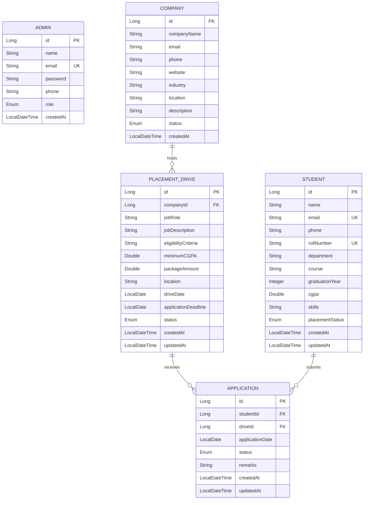

# Complete Presentation & Viva Guide: Placement Management System (Admin Service)

This comprehensive guide is designed for your **College Project Presentation and Viva Voce**. It includes the architecture breakdown, database schema, word-for-word presentation speech, an ordered Postman live demonstration script, and answers to examiner questions.

---

## Table of Contents
1. [Presentation Strategy & Time Allocation](#1-presentation-strategy--time-allocation)
2. [System Architecture & Engineering Design](#2-system-architecture--engineering-design)
3. [Database Architecture & Entity Relationships](#3-database-architecture--entity-relationships)
4. [Live Postman Demo Script (Step-by-Step)](#4-live-postman-demo-script-step-by-step)
5. [Word-for-Word Presentation Speech (Viva Script)](#5-word-for-word-presentation-speech-viva-script)
6. [Core Technical Design Decisions to Highlight](#6-core-technical-design-decisions-to-highlight)
7. [Future Microservices Integration Plan](#7-future-microservices-integration-plan)
8. [Top 15 Viva Questions & Model Answers](#8-top-15-viva-questions--model-answers)

---

## 1. Presentation Strategy & Time Allocation

Recommended presentation duration: **10 to 12 minutes** (plus 3-5 minutes of Q&A).

| Section | Target Time | Key Goal |
| :--- | :--- | :--- |
| **Introduction & Problem Scope** | 1.5 mins | Clarify project scope and why Admin Service was built independently. |
| **Architecture & Tech Stack** | 2.5 mins | Explain layered design, Spring Boot 3, Java 21, JPA, and H2 database. |
| **Live Demonstration (Postman)** | 5.0 mins | Walk through the 7-step interactive workflow showing live business logic. |
| **Database & Dynamic Dashboard** | 1.5 mins | Show the H2 console and demonstrate live recalculated analytics. |
| **Conclusion & Future Scope** | 1.0 min | Explain future integration with Login and Student services. |
| **Viva Q&A** | 3-5 mins | Confidently answer architectural and code-level questions. |

---

## 2. System Architecture & Engineering Design

### Microservices Landscape
The overall college placement solution consists of three specialized services:
1. **Login Service**: Authentication, role authorization, and token issuance.
2. **Student Service**: Student resume builder and individual application portal.
3. **Admin Service (Your Scope)**: Campus placement drive scheduling, company onboarding, student records administration, application status processing, and live analytical dashboards.

```
       +-------------------------------------------------------------+
       |               Placement Management System                   |
       +-------------------------------------------------------------+
                                      |
         +----------------------------+----------------------------+
         |                                                         |
[Login Service]                                            [Student Service]
(Auth / Security)                                         (Student Portal)
         |                                                         |
         +----------------------------+----------------------------+
                                      | (Future Event/REST Bus)
                                      v
                   +-------------------------------------+
                   |      ADMIN SERVICE (YOUR CORE)      |
                   |  - Admins & Authentication          |
                   |  - Student Master Records           |
                   |  - Company Onboarding               |
                   |  - Placement Drives Management      |
                   |  - Application Status Cascade       |
                   |  - Dynamic Real-Time Analytics      |
                   +-------------------------------------+
```

### Clean Layered Backend Architecture
The Admin Service follows enterprise clean layered architecture:

```
[ HTTP Client / Postman / Browser ]
                │  JSON Request / Response
                ▼
[ Controller Layer ] (@RestController)
  ├── AdminController, StudentController, CompanyController
  ├── PlacementDriveController, ApplicationController, DashboardController
                │  DTOs (Data Transfer Objects)
                ▼
[ Service Layer ] (@Service, @Transactional)
  ├── Business validation, Entity-DTO mapping, Status sync cascades
  ├── AdminServiceImpl, StudentServiceImpl, CompanyServiceImpl, etc.
                │  Domain Entities
                ▼
[ Repository Layer ] (@Repository, Spring Data JPA)
  ├── AdminRepository, StudentRepository, CompanyRepository, etc.
  ├── Hibernate ORM / SQL query generation
                │  JDBC
                ▼
[ Database Layer ] (In-Memory H2 Database: jdbc:h2:mem:placementdb)
```

---

## 3. Database Architecture & Entity Relationships

The relational model enforces data integrity using primary keys, foreign keys, unique constraints, and check validations.

### Entity Relationship Diagram (ERD)



### Critical Business Constraints Built Into the Database & Entities
1. **Student Uniqueness**: Both `email` and `rollNumber` have database-level unique constraints (`unique = true`).
2. **Admin Email Uniqueness**: `email` is unique across all administrators.
3. **Application Uniqueness**: Unique composite constraint on `(student_id, drive_id)` prevents any student from applying to the same placement drive more than once.
4. **Date Consistency**: `applicationDeadline` is validated to ensure it is never scheduled after `driveDate`.
5. **Cascade Placement Status**: When an application transitions to `SELECTED`, the associated student's `placementStatus` automatically flips from `NOT_PLACED` to `PLACED`.

---

## 4. Live Postman Demo Script (Step-by-Step)

During your presentation, follow this sequence in Postman. It tells a cohesive story of a student getting placed in a campus drive.

```
+-------------------------------------------------------------------------+
|                  DEMO FLOW AT A GLANCE (7 MINUTES)                      |
|                                                                         |
|  1. Baseline Dashboard  ──>  2. Admin Security Check                    |
|             │                               │                           |
|             ▼                               ▼                           |
|  3. Student Registration ──> 4. Company & Drive Setup                   |
|             │                               │                           |
|             ▼                               ▼                           |
|  5. Student Application ──> 6. Selection & Auto Status Cascade         |
|                                             │                           |
|                                             ▼                           |
|                                7. Updated Live Dashboard                |
+-------------------------------------------------------------------------+
```

### Stage 1: Inspect Preloaded Baseline Metrics
* **Folder**: `06 - Dashboard APIs`
* **Request**: `Get Placement Dashboard Statistics` (`GET http://localhost:8080/api/admin/dashboard`)
* **What to say**:
  > *"As you can see, our dashboard dynamically queries the database upon every request. Right now we have 10 students, 5 companies, 5 drives, 15 applications, with 4 placed and 6 unplaced students."*

---

### Stage 2: Admin Authentication & Data Protection
* **Folder**: `01 - Admin APIs`
* **Request**: `Admin Login` (`POST http://localhost:8080/api/admins/login`)
* **Body**:
  ```json
  {
    "email": "admin@placement.edu",
    "password": "admin123"
  }
  ```
* **What to say**:
  > *"We have implemented dedicated admin authentication. Notice in the response that the password field is completely excluded. We enforce DTO separation so sensitive credentials are never serialized back to clients."*

---

### Stage 3: Student Onboarding & Input Validation
* **Folder**: `02 - Student APIs`
* **Request**: `Create Student` (`POST http://localhost:8080/api/students`)
* **Body**:
  ```json
  {
    "name": "Manish Malhotra",
    "email": "manish.m@example.com",
    "phone": "+91 9811223344",
    "rollNumber": "CSE011",
    "department": "Computer Science",
    "course": "B.Tech",
    "graduationYear": 2026,
    "cgpa": 8.92,
    "skills": "Java, Spring Boot, React, Docker",
    "placementStatus": "NOT_PLACED"
  }
  ```
* **What to say**:
  > *"Now an administrator onboards a new student. The system assigns ID 11, defaults their status to NOT_PLACED, and validates their CGPA, email format, and unique roll number."*

*(Optional Show of Validation: Change CGPA to 12.0 and hit Send $\rightarrow$ Show the clean 400 Bad Request error response).*

---

### Stage 4: Company Registration & Search
* **Folder**: `03 - Company APIs`
* **Request**: `Create Company` (`POST http://localhost:8080/api/companies`)
* **Body**:
  ```json
  {
    "companyName": "Stripe India Tech",
    "email": "careers@stripe.com",
    "phone": "+91 8099887766",
    "website": "https://stripe.com",
    "industry": "Financial Technology",
    "location": "Bengaluru, Karnataka",
    "description": "Enterprise payments and billing infrastructure.",
    "status": "ACTIVE"
  }
  ```
* **Follow-up Request**: `Search Companies By Name` (`GET /api/companies/search?name=Stripe`)
* **What to say**:
  > *"We register a recruitment partner and immediately test our case-insensitive search API to retrieve matching active companies."*

---

### Stage 5: Scheduling a Placement Drive
* **Folder**: `04 - Placement Drive APIs`
* **Request**: `Create Placement Drive` (`POST http://localhost:8080/api/drives`)
* **Body**:
  ```json
  {
    "companyId": 6,
    "jobRole": "Full Stack Engineer",
    "jobDescription": "Build microservices and modern web interfaces.",
    "eligibilityCriteria": "B.Tech CSE/IT with 7.5+ CGPA",
    "minimumCGPA": 7.5,
    "package": 14.5,
    "location": "Bengaluru",
    "driveDate": "2026-10-25",
    "applicationDeadline": "2026-10-15",
    "status": "OPEN"
  }
  ```
* **What to say**:
  > *"The placement drive references company ID 6. The service validates that company 6 exists and checks that the application deadline is earlier than the actual drive date."*

---

### Stage 6: Application Lifecycle & Automatic Status Cascade
* **Folder**: `05 - Application APIs`
* **Step 6A - Apply**: `Create Application` (`POST http://localhost:8080/api/applications`)
  * **Body**:
    ```json
    {
      "studentId": 11,
      "driveId": 6,
      "remarks": "Candidate applied for Full Stack Engineer role"
    }
    ```
  * Shows: Status is `APPLIED`.
* **Step 6B - Prevent Duplicate**: Hit Send again!
  * Shows: **`409 CONFLICT`** with message: *"Student (ID 11) has already applied for Placement Drive (ID 6)"*.
* **Step 6C - Selection & Auto Sync**: `Update Application Status` (`PUT http://localhost:8080/api/applications/{id}`)
  * Use the ID returned in 6A:
    ```json
    {
      "status": "SELECTED",
      "remarks": "Cleared technical interviews. Offer letter of 14.5 LPA extended."
    }
    ```
* **Step 6D - Verification**: Open `Get Student By ID` (`GET http://localhost:8080/api/students/11`)
* **What to say**:
  > *"Notice this key business automation: as soon as Manish's application was updated to SELECTED, the student entity was automatically updated to PLACED in the database without any manual administrator intervention."*

---

### Stage 7: Recalculated Live Dashboard
* **Folder**: `06 - Dashboard APIs`
* **Request**: `Get Placement Dashboard Statistics` (`GET /api/admin/dashboard`)
* **What to say**:
  > *"Now when we call the dashboard endpoint again: totalStudents has risen to 11, totalCompanies to 6, totalPlacementDrives to 6, totalApplications to 16, and placedStudents has incremented to 5. Every single value is calculated via JPA aggregate counts from the database."*

---

### Stage 8: H2 In-Memory Database Console
* Open browser at: `http://localhost:8080/h2-console`
* Connect with JDBC URL `jdbc:h2:mem:placementdb`, user `sa`.
* Run: `SELECT * FROM STUDENTS WHERE ID = 11;`
* Run: `SELECT * FROM APPLICATIONS WHERE STUDENT_ID = 11;`
* **What to say**:
  > *"Finally, here is our live in-memory H2 relational database showing our normalized tables, auto-generated IDs, foreign keys, and updated timestamps."*

---

## 5. Word-for-Word Presentation Speech (Viva Script)

Use this script during your presentation:

### Introduction (0:00 - 1:30)
> *"Respected evaluators and professors, good morning. Today, I am presenting the backend implementation of the **Placement Management System**, focusing specifically on the core **Admin Service**.
>
> In university campuses, placement offices face significant administrative friction: tracking dozens of visiting companies, managing eligibility criteria across branches, reviewing hundreds of student applications, and generating real-time placement statistics for accreditations like NAAC and NBA.
>
> While our complete institutional vision involves three microservices—Login Service, Student Service, and Admin Service—**my specific responsibility and engineering deliverable is the Admin Service backend**.
>
> I have architected this service to be completely autonomous, fully testable independently through REST APIs, and backed by a comprehensive automated test suite."*

### Architecture & Engineering (1:30 - 3:30)
> *"For the technology stack, I chose:
> * **Java 21 LTS** for robust type safety and modern language features.
> * **Spring Boot 3.3.4** as the enterprise application framework.
> * **Spring Data JPA with Hibernate ORM** for clean data persistence.
> * **Jakarta Bean Validation** for request payload constraints.
> * An **in-memory H2 database** for zero-configuration, self-contained development and demonstration.
>
> We follow a strict layered architecture: Controllers receive requests and map to DTOs; the Service layer handles transactional business logic; Repositories provide clean abstraction over SQL; and Entities map to relational database tables.
>
> Crucially, I have applied the **Data Transfer Object (DTO) pattern**. Internal database entities like `Admin` store encrypted passwords, but our response DTOs strictly omit sensitive fields, preventing accidental credential exposure. All dependencies are injected via **Constructor Injection**, adhering to clean code standards."*

### Live Demonstration Transition (3:30 - 8:30)
> *(Open Postman and follow Section 4 step-by-step)*
>
> *"Let us move into the live demonstration using Postman.
>
> First, our baseline Dashboard API shows dynamic aggregate statistics.
> Next, our Admin Login endpoint validates credentials and returns clean user context without sensitive data.
> Now, let us onboard a new student. Notice that when invalid data like a CGPA of 12 is passed, our Global Exception Handler intercepts the validation exception and returns a structured 400 Bad Request with field-level error messages.
>
> Next, we schedule a campus placement drive for an onboarded company. The application verifies that the company exists and ensures the application deadline cannot fall after the drive date.
>
> Now, we submit an application. If the student tries to apply twice, our unique database constraint and service check return a 409 Conflict.
>
> Finally, when the administrator marks this candidate's application as `SELECTED`, our service layer automatically executes a transaction that cascades this outcome, flipping the student's status to `PLACED`.
>
> Returning to our dashboard endpoint, all metric totals—students, drives, applications, and placed counts—have updated dynamically in real time."*

### Conclusion & Future Roadmap (8:30 - 10:00)
> *"In summary, the Admin Service backend is 100% complete, fully verified with 36 automated tests, and operates independently without requiring external servers.
>
> In the next phase of the project, this service will integrate seamlessly into our campus microservices architecture:
> 1. Replacing our standalone login with JWT Bearer tokens issued by the **Login Service**.
> 2. Synchronizing student resumes and profile updates asynchronously via Kafka or OpenFeign from the **Student Service**.
> 3. Transitioning the database configuration from H2 to enterprise PostgreSQL or MySQL simply by changing our `application.properties` driver configuration.
>
> Thank you. I am now open to your questions."*

---

## 6. Core Technical Design Decisions to Highlight

When examiners ask why you structured something in a particular way, highlight these four design patterns:

### 1. Constructor-Based Dependency Injection
```java
@Service
@Transactional
public class StudentServiceImpl implements StudentService {
    private final StudentRepository studentRepository;

    // Constructor injection guarantees immutability and simplifies unit testing
    public StudentServiceImpl(StudentRepository studentRepository) {
        this.studentRepository = studentRepository;
    }
}
```
* **Why**: Avoids `@Autowired` field injection which hides dependencies, violates immutability, and makes unit tests harder to write without Spring context.

### 2. DTO Layer Isolation & Password Safety
* Database entities (`Admin.java`) contain the `password` column.
* Public API responses return `AdminResponseDTO.java` which **has no password field**.
* Request objects use validation annotations like `@NotBlank`, `@Email`, `@DecimalMin`, and `@DecimalMax`.

### 3. Centralized Exception Handling (`@RestControllerAdvice`)
* Rather than scattering `try-catch` blocks inside controllers, `GlobalExceptionHandler.java` intercepts exceptions application-wide:
  * `ResourceNotFoundException` $\rightarrow$ **404 Not Found**
  * `DuplicateResourceException` $\rightarrow$ **409 Conflict**
  * `MethodArgumentNotValidException` $\rightarrow$ **400 Bad Request** (with field-by-field map)
  * `InvalidOperationException` $\rightarrow$ **400 Bad Request**

### 4. Automatic Placement Status Synchronization
```java
if (statusUpdateDTO.getStatus() == ApplicationStatus.SELECTED) {
    Student student = application.getStudent();
    student.setPlacementStatus(PlacementStatus.PLACED);
    studentRepository.save(student);
}
```
* Eliminates human error: placing a student automatically synchronizes across all analytical queries.

---

## 7. Future Microservices Integration Plan

Be ready to explain how this service fits into the multi-service architecture:

```
                  +-----------------------------------+
                  |         API GATEWAY (8080)        |
                  |     (Spring Cloud Gateway)        |
                  +-----------------+-----------------+
                                    |
          +-------------------------+-------------------------+
          |                         |                         |
          v                         v                         v
+-------------------+     +-------------------+     +-------------------+
|   LOGIN SERVICE   |     |  STUDENT SERVICE  |     |   ADMIN SERVICE   |
|     (Port 8081)   |     |    (Port 8082)    |     |    (Port 8083)    |
| - OAuth2 / JWT    |     | - Resume builder  |     | - Drive management|
| - Password hash   |     | - Job discovery   |     | - Company portal  |
| - Role management |     | - Apply action    |     | - Analytics       |
+-------------------+     +-------------------+     +-------------------+
          |                         |                         |
          +───────────────┬─────────┴─────────────────────────+
                          │
                          ▼
            [ Apache Kafka / RabbitMQ Event Bus ]
            (e.g., student.registered, application.selected)
```

1. **Token Verification**: Admin Service will include `spring-boot-starter-oauth2-resource-server` to validate JWT signatures issued by Login Service.
2. **Event-Driven Updates**: When Student Service updates a student profile, it publishes an event consumed by Admin Service.
3. **Database Migration**: Swap H2 for PostgreSQL in `pom.xml` and update JDBC connection strings in `application.properties`.

---

## 8. Top 15 Viva Questions & Model Answers

### Q1: What is the main responsibility of the Admin Service?
> **Answer**: The Admin Service manages administrative operations for campus placements: maintaining student eligibility records, onboarding recruiting companies, scheduling placement drives, managing student application stages, and computing dynamic placement metrics.

### Q2: Why did you build the Admin Service independently instead of all three services together?
> **Answer**: In modern microservice architecture, each service must be independently deployable, maintainable, and testable. By developing the Admin Service as a standalone service with clear REST API contracts and an in-memory database, it can be tested completely without depending on external services.

### Q3: Why did you use DTOs instead of exposing JPA entities directly in your controllers?
> **Answer**: Exposing JPA entities directly creates tight coupling between the database schema and the API contract, risks circular references during JSON serialization with bidirectional relationships, and exposes sensitive fields like passwords. DTOs allow precise control over what data is accepted and returned.

### Q4: How do you prevent sensitive passwords from leaking through your APIs?
> **Answer**: The `AdminResponseDTO` class does not contain any password field. When querying admins, only non-sensitive fields (id, name, email, phone, role, createdAt) are mapped to the response. Additionally, passwords are never included in application logs.

### Q5: How is your Placement Dashboard calculated? Are the values hardcoded?
> **Answer**: None of the values are hardcoded. Every metric in `DashboardServiceImpl` is dynamically queried from the database using JPA repository aggregation methods like `count()`, `countByStatus()`, and `countByPlacementStatus()`. Any insert, update, or status change is reflected immediately.

### Q6: How do you prevent a student from applying to the same placement drive twice?
> **Answer**: We enforce this at two layers:
> 1. At the database level using a unique composite constraint: `@UniqueConstraint(columnNames = {"student_id", "drive_id"})`.
> 2. At the service level using `applicationRepository.existsByStudentIdAndPlacementDriveId()`, which throws a custom `DuplicateResourceException` mapped to HTTP `409 Conflict`.

### Q7: What happens to a student's placement status when they get selected?
> **Answer**: In `ApplicationServiceImpl.updateApplicationStatus()`, whenever an application status transitions to `SELECTED`, the associated `Student` entity is fetched and its `placementStatus` is updated to `PLACED` within the same transaction.

### Q8: What database are you using, and how would you migrate to production?
> **Answer**: We use the H2 in-memory database with `DB_CLOSE_DELAY=-1` for zero-configuration development and demonstration. To migrate to production (e.g., PostgreSQL or MySQL), we only need to add the PostgreSQL/MySQL driver dependency in `pom.xml` and update the `spring.datasource.url`, username, and password in `application.properties`. No Java code changes are needed because Hibernate abstracts the SQL dialect.

### Q9: Why did you choose Constructor Injection over Field Injection (`@Autowired`)?
> **Answer**: Constructor injection enforces that required dependencies cannot be null, supports class immutability using `final` fields, avoids hidden dependencies, and allows easy instantiation in unit tests without requiring a full Spring container.

### Q10: How does your Global Exception Handling work?
> **Answer**: We use `@RestControllerAdvice` on `GlobalExceptionHandler`. When any controller throws an exception like `ResourceNotFoundException` or a validation error, Spring intercepts it and formats a consistent JSON `ErrorResponse` containing timestamp, HTTP status code, error message, and request path.

### Q11: How do you validate request data like CGPA or emails?
> **Answer**: We use Jakarta Bean Validation annotations on DTOs: `@NotBlank` for strings, `@Email` for valid email formats, `@DecimalMin("0.0")` and `@DecimalMax("10.0")` for CGPA, and `@Positive` for package amounts. Controllers use `@Valid` to trigger validation before service execution.

### Q12: Why is the package salary field named `packageAmount` in Java?
> **Answer**: In Java, `package` is a reserved language keyword and cannot be used as an identifier. We named the field `packageAmount` in Java and used Jackson annotations `@JsonProperty("package")` and `@JsonAlias({"packageAmount", "packageSalary"})` so that REST clients can send and receive `"package"` in JSON.

### Q13: How is initial sample data loaded when the application starts?
> **Answer**: We implemented a Spring `CommandLineRunner` component named `DataInitializer`. Its `run()` method checks whether the database is empty and, if so, inserts 3 Admins, 10 Students, 5 Companies, 5 Placement Drives, and 15 Applications in an orderly transactional sequence.

### Q14: How are automated tests structured in this project?
> **Answer**: We have 36 automated tests across smoke, controller, and repository layers using JUnit 5, Spring Boot Test, and MockMvc. We test success scenarios as well as edge cases: duplicate emails, duplicate roll numbers, invalid CGPA, non-existent entity lookups, drive deadline violations, and dashboard calculation accuracy.

### Q15: How will this service authenticate requests once the Login Service is built?
> **Answer**: The Login Service will issue signed JWT (JSON Web Token) tokens upon valid user login. In the Admin Service, we will add `spring-boot-starter-oauth2-resource-server` to intercept incoming requests, validate the JWT signature, extract the admin's role claim, and protect endpoints with `@PreAuthorize("hasRole('ADMIN')")`.

---

## 9. Quick Presentation Checklist Before You Present

* [ ] **Application is Running**: Confirm in PowerShell that `.\mvnw.cmd spring-boot:run` is running without errors.
* [ ] **Health Endpoint Works**: Open `http://localhost:8080/` in your browser to verify the service status is `"UP"`.
* [ ] **Postman Collection Loaded**: Ensure `Placement Admin Service API Collection` is visible in Postman with all 6 folders.
* [ ] **H2 Console Accessible**: Verify [http://localhost:8080/h2-console](http://localhost:8080/h2-console) connects with `jdbc:h2:mem:placementdb` and `sa`.
* [ ] **Test Results Handy**: Know that **36 out of 36 tests pass** with 0 failures (`.\mvnw.cmd clean test`).
